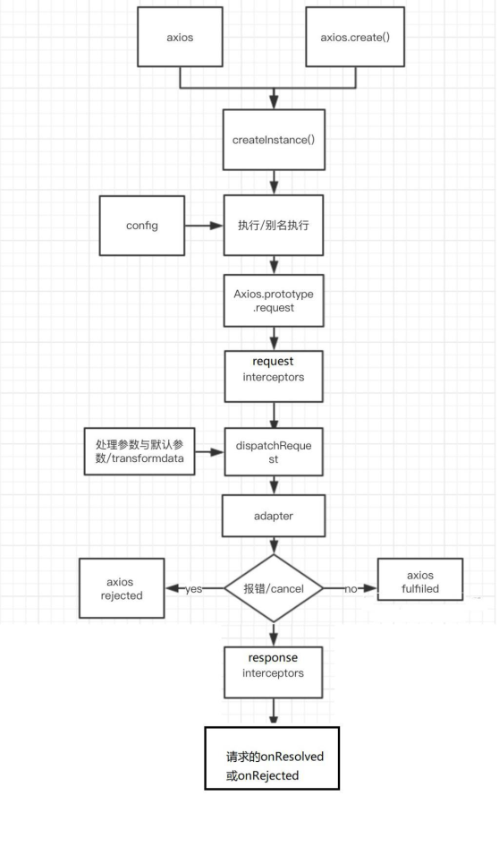
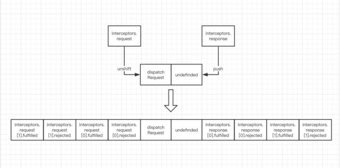

---
typora-copy-images-to:media
---
# Axios入门到源码分析
## 第一章：HTTP相关
### 1.1 MDN文档
https://developer.mozilla.org/zh-CN/docs/Web/HTTP/Overview
### 1.2 HTTP请求交互的基本过程
客户端---（请求行、请求头、请求体） --->服务器
客户端<---（状态行、响应头、实体内容）---服务器
1. 前后应用从浏览器端向服务器发送HTTP请求（请求报文）
2. 后台服务器接受到请求后，调度服务器应用处理请求，向浏览器端返回HTTP响应（响应报文）
3. 浏览器端接受到响应，解析显示响应体/调用监视回调
### 1.3 HTTP请求报文
1. 请求行
 - 格式：method url
    - GET /product_datail?id=2
    - POST /login
2. 多个请求头
 - ```Host: www.baidu.com```
 - ```Cookie: BAIDUID=AD3B0FA706E;BIDUPSID=AD3B0FA706;```
 - ```Content-Type: application/x-www-form-urlencoded``` 或者 ```application/josn```
3. 请求体
 - ```username=tom&password=123``` - urlencoded格式
 - ```{"username":"tom", "pwd":123}``` - json格式
### 1.4 HTTP相应报文
1. 响应状态行：```status statusText```
2. 多个响应头
 - ```Content-Type: text/html;charset=utf-8```
 - ```Set-Cookie:BD_CK_SAM=1;path=/```
3. 响应体
 - html文本/json文本/js/css/图片...
### 1.5 post请求体参数格式
4. ```Content-Type: application/x-www-form-urlencoded;charset=utf-8```
用于键值对参数，参数的键值用=链接，参数之间用&连接
例如：name=%E5%B0%8F%E6%98%8E&age=12
5. ```Content-Type: application/json;charest=utf-8```
用于json字符串参数
例如：{"name":"%E5%B0%8F%E6%98%8E","age":12}
6. ```Content-Type: multipart/form-data```
用于文件上传请求
### 1.6 常见的响应状态码
|状态码|状态文本|含义|
|-----|-------|---|
|200| OK|请求成功。一般用于GET与POST请求|
|201| Created|已创建。成功请求并创建了新的资源|
|401| Unauthorized|未授权/请求要求用户的身份认证|
|404| Not Found|服务器无法根据客户端的请求找到资源|
|500| Internal Server Error|服务器内部错误，无法完成请求|
### 1.7 不同类型的请求及其作用
1. ```GET```：从服务器段读取数据
2. ```POST```：向服务器段添加新数据
3. ```PUT```：更新服务器段已有数据
4. ```DELETE```：删除服务器端数据
### 1.8 API的分类
1. REST API：restful
   1. 发送请求进行CRUD哪个操作由请求方式来决定
   2. 同一个请求路径额可以进行多个操作
   3. 请求方式会用到GET/POST/PUT/DELETE
2. 非REST API： restless
   1. 请求方式不决定请求的CRUD操作
   2. 一个请求路径只对应一个操作
   3. 一般只有GET/POST

## 第2章：XHR的理解和使用
### 2.1 MDN文档
https://developer.mozilla.org/zh-CN/docs/Web/API/XMLHttpRequest
### 2.2 理解
1. 使用```XMLHttpRequest(XHR)```对象可以与服务器交互，也就是发送ajax请求
2. 前端可以获取到数据，而无需让整个的页面刷新
3. 这使得Web页面可以只更新页面的局部，而不影响用户的操作
### 2.3 区别一般http请求和ajax请求
1. ajax请求是一种特别的http请求
2. 对服务器端来说，没有任何区别，区别在浏览器端
3. 浏览器端发请求，只有XHR或fetch发出的才是ajax请求，其他所有的都是非ajax请求
4. 浏览器端接收到响应
   1. 一般请求：浏览器一般会直接显示响应体数据，也就是常说的刷新/跳转页面
   2. ajax请求：浏览器不会对界面进行任何更新操作，只是调用监视的回调函数并传入响应相关数据
### 2.4 API
1. ```XMLHttpRequest()```: 创建XHR对象的构造函数
2. ```status```: 响应状态码值，比如200,404
3. ```statusText```: 响应状态文本
4. ```readyState```: 标识请求状态的只读属性
   1. 0：初始
   2. 1：```open()```之后
   3. 2：```send()```之后
   4. 3：请求中
   5. 4：请求完成
5. ```onreadystateChange```: 绑定readyState改变的监听
6. ```responseType```: 指定响应数据类型，如果是'json'，得到响应后自动解析响应体数据
7. ```response```: 响应体数据，类型取决于responseType的指定
8. ```timeout```: 指定请求超时时间，默认为0代表没有限制
9. ```ontimeout```: 绑定超时的监听
10. ```onerror```: 绑定请求网络错误的监听
11. ```open()```: 初始化一个请求，参数为```(method:string, url:string[, async:bool])```
12. ```send(data)```: 发送请求
13. ```abort()```:中断请求
14. ```getResponseHeader(name)```: 获取指定名称的响应头值
15. ```getAllResponseHeaders()```: 获取所有响应头组成的字符串
16. ```setRequestHeader(name, value)```: 设置请求头

### 2.5 XHR的ajax封装（简单版axios）
#### 2.5.1 特点
1. 函数的返回值为Promise，成功的结果为response，异常的结果为error
2. 能处理多种类型的请求：```GET/POST/PUT/DELETE```
3. 函数的参数为一个配置对象
```json
{
   url: "", //请求地址
   method: "", //请求方式GET/POST/PUT/DELETE
   params:{}, //GET/DELETE请求的query参数
   data:{}, //POST/DELETE请求的请求体参数
}
```
4. 响应json数据自动解析为js对象或者数组

## 第3章：axios的理解和使用
### 3.1 axios是什么？
1. 前端最流行的ajax请求库
2. react/vue官方都推荐使用axios发送ajax请求
3. 文档：https://github.com/axios/axios
### 3.2 axios特点
1. 基本promise的异步ajax请求库
2. 浏览器端/node端都可以使用
3. 支持请求/响应拦截器
4. 支持请求取消
5. 请求/响应数据转换
6. 批量发送多个请求
### axios常用语法
```axios(config)```: 通用/最本质的发任意类型请求的方式
```axios(url[,config])```: 可以只指定url发get请求
```axios.request(config)```: 等同于```axios(config)```
```axios.get(url[,config])```: 发get请求
```axios.delete(url[,config])```: 发delete请求
```axios.post(url[,data[,config]])```: 发post请求
```axios.put(url[,data[,config]])```: 发put请求

```axios.defaults.xxx```: 请求的默认全局配置
```axios.interceptors.request.use()```: 添加请求拦截器
```axios.interceptors.response.use()```: 添加响应拦截器

```axios.create([config])```: 创建一个新的axios（它没有下面的功能）

```axios.Cancel()```: 用于创建取消请求的错误对象
```axios.CancelToken()```: 用于创建取消请求的token对象
```axios.isCancel()```: 是否是一个取消请求的错误
```axios.all(promises)```: 用于批量执行多个异步请求
```axios.spread()```: 用来指定接收所有成功数据的回调函数的方法，与all配合使用

### 3.4 难点语法的理解和使用
#### 3.4.1 axios.create(config)
1. 根据指定配置创建一个新的axios，也就是每个新axios都有自己的配置
2. 新axios只是没有取消请求和批量发送请求的方法，其他所有语法都是一致的
3. 为什么要设计这个语法？
   1. 需求：项目中有部分接口需要的配置与另一部分接口需要的配置不太一样，如何处理
   2. 解决：创建2个新axios，每个都有自己特有的配置，分别应用到不同需求的接口请求中
#### 3.4.2 拦截器函数/ajax请求/请求的回调函数的调用顺序
1. 说明: 调用 axios()并不是立即发送 ajax 请求, 而是需要经历一个较长的流程
2. 流程: 请求拦截器2 => 请求拦截器1 => 发ajax请求 => 响应拦截器1 => 响应拦截器 2 => 请求的回调
3. 注意：此流程是通过promise串连起来的，请求拦截器传递的是config，响应拦截器传递的是response
#### 3.4.3 取消请求
1. 基本流程
   1. 配置cancelToken对象
   2. 缓存用于取消请求的cancel函数
   3. 在后面特定时机调用cancel函数取消请求
   4. 在错误回调中判断如果error是cancel，做相应处理
2. 实现功能

## 第4章 axios源码分析
### 4.1 axios源码目录结构
```
├── /dist/ # 项目输出目录
├── /lib/ # 项目源码目录
│ ├── /adapters/ # 定义请求的适配器 xhr、 http
│ │ ├── http.js # 实现 http 适配器(包装 http 包)
│ │ └── xhr.js # 实现 xhr 适配器(包装 xhr 对象)
│ ├── /cancel/ # 定义取消功能
│ ├── /core/ # 一些核心功能
│ │ ├── Axios.js # axios 的核心主类
│ │ ├── dispatchRequest.js # 用来调用 http 请求适配器方法发送请求的函数
│ │ ├── InterceptorManager.js # 拦截器的管理器
│ │ └── settle.js # 根据 http 响应状态，改变 Promise 的状态
│ ├── /helpers/ # 一些辅助方法
│ ├── axios.js # 对外暴露接口
│ ├── defaults.js # axios 的默认配置
│ └── utils.js # 公用工具
├── package.json # 项目信息
├── index.d.ts # 配置 TypeScript 的声明文件
└── index.js # 入口文件
```
### 4.2 源码分析
#### 4.2.1 axios 与 Axios 的关系 ?
1. 从语法上来说: axios 不是 Axios 的实例
2. 从功能上来说: axios 是 Axios 的实例
3. axios 是 ```Axios.prototype.request``` 函数 ```bind()```返回的函数
4. axios 作为对象有 Axios 原型对象上的所有方法, 有 Axios 对象上所有属性
#### 4.2.2 instance 与 axios 的区别?
1. 相同:
   1. 都是一个能发任意请求的函数: ```request(config)```
   2. 都有发特定请求的各种方法: ```get()/post()/put()/delete()```
   3.  都有默认配置和拦截器的属性: ```defaults/interceptors```
2. 不同:
   1. 默认匹配的值很可能不一样
   2. instance 没有 axios 后面添加的一些方法: ```create()/CancelToken()/all()```

#### 4.2.3 axios运行的整体流程

1. 整体流程:
```request(config) ==> dispatchRequest(config) ==> xhrAdapter(config)```
2. ```request(config)```:
将请求拦截器 / ```dispatchRequest()``` / 响应拦截器 通过 promise 链**串连**起来,返回 promise
3. ```dispatchRequest(config)```:
**转换请求数据** ===> 调用 xhrAdapter()发请求 ===> 请求返回后**转换响应数据**。返回 promise
4. ```xhrAdapter(config)```:
创建 XHR 对象, 根据 config 进行相应设置, **发送特定请求**, 并接收响应数据,返回 promise

#### 4.2.4 axios 的请求/响应拦截器是什么?

1. 请求拦截器:
- 在真正发送请求前执行的回调函数
- 可以对请求进行检查或配置进行特定处理
- 成功的回调函数, 传递的默认是 config(也必须是)
- 失败的回调函数, 传递的默认是 error
2. 响应拦截器
- 在请求得到响应后执行的回调函数
- 可以对响应数据进行特定处理
- 成功的回调函数, 传递的默认是 response
- 失败的回调函数, 传递的默认是 error
#### 4.2.5 axios 的请求/响应数据转换器是什么?
1. 请求转换器: 对请求头和请求体数据进行特定处理的函数
```javascript
if (utils.isObject(data)) {
   setContentTypeIfUnset(headers, 'application/json;charset=utf-8');
   return JSON.stringify(data);
}
```
2. 响应转换器: 将响应体 json 字符串解析为 js 对象或数组的函数
```javascript
response.data = JSON.parse(response.data)
```
#### 4.2.6 response整体结构
```
{
   data,
   status,
   statusText,
   headers,
   config,
   request
}
```
#### 4.2.7 error整体结构
```
{
   message,
   response,
   request
}
```
#### 4.2.8 如何取消未完成的请求？
1. 当配置了 cancelToken 对象时，保存 cancel 函数
   1. 创建一个用于将来中断请求的 cancelPromise
   2. 并定义了一个用于取消请求的 cancel 函数
   3. 将 cancel 函数传递出来
2. 调用 cancel()取消请求
   1. 执行 cacel 函数，传入错误信息 message
   2. 内部会让 cancelPromise 变为成功，且成功的值为一个 Cancel 对象
   3. 在 cancelPromise 的成功回调中中断请求，并让发请求的 proimse 失败，失败的 reason 为 Cacel 对象