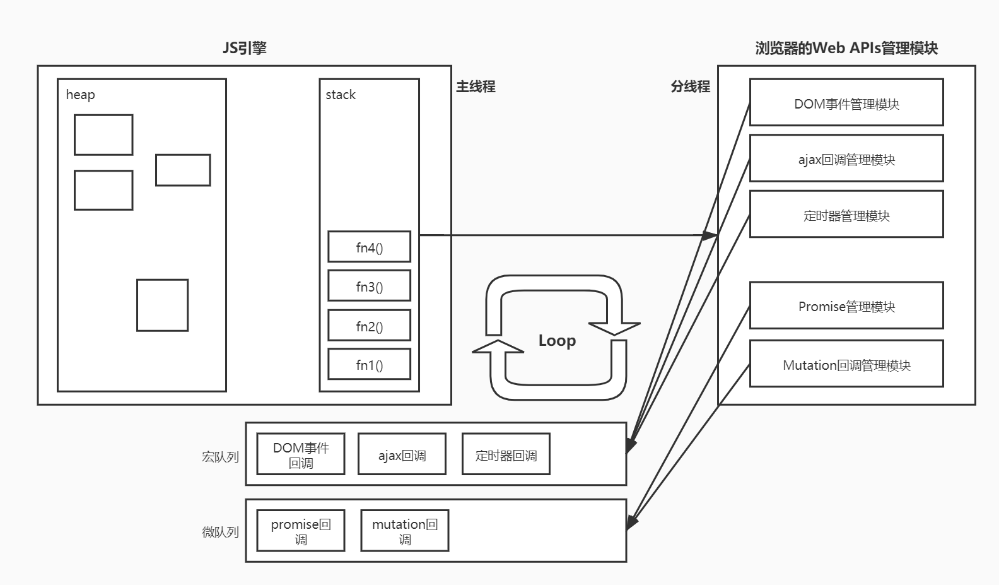

---
typora-copy-images-to:media
---
## 准备
### 1.1. 区别实例对象与函数对象
1. 实例对象：new函数产生的对象，称为实例对象，简称为对象
2. 函数对象：将函数作为对象使用时，简称为函数对象
```javascript
    function Fn(){

    }
    const fn = new Fn()
    console.log(Fn.prototype)
    Fn.bind({})
    $('test')
    $.get('/test')
```
### 1.2. 二种类型的回调函数
#### 1.2.1. 同步回调
1. 理解：立即执行，完全执行完了才结束，不会放入回调队列中
2. 例子：数组遍历相关的回调函数/Promise的executor函数
#### 1.2.2. 异步回调
1. 理解：不会立即执行，放入回调队列中将来执行
2. 定时器回调/ajax回调/Promise的成功|失败的回调

### 1.3. JS的Error处理
#### 1.3.1. 错误的类型
1. Error：所有错误的父类型
2. ReferenceError：引用的变量不存在
3. TypeError：数据类型不正确的错误
4. RangeError：数据值不在其所允许的范围内
5. SyntaxError：语法错误
#### 1.3.2. 错误处理
1. 捕获错误：```try...catch```
2. 抛出错误：```throw error```
#### 1.3.3. 错误对象
1. message属性：错误相关信息
2. stack属性：函数调用栈记录信息

## Promise的理解和使用
### 2.1. Promise是什么？
#### 2.1.1. 理解
1. 抽象表达：Promise是JS中进行一步编程的新的解决方案（旧的是谁？）
2. 具体表达：
   1. 从语法上来说：Promise是一个构造函数
   2. 从功能上来说：Promise对象用来封装一个异步操作并可以获取其结果
#### 2.1.2 Promise的状态改变
0. 有3个状态:pending（初始）、resolved、rejected
1. pending变为resolved
2. pending变为rejected
说明：只有这2中，且一个promise对象只能改变一次，无论变为成功还是失败，都会有一个结果数据，成功的数据一般称为value，失败的数据一般称为reason
#### 2.1.3 Promise基本流程


### 2.2. 为什么要使用Promise？
#### 2.2.1 指定回调函数的方式更加灵活
1. 旧的：必须在启动异步任务前指定
2. promise：启动异步任务=>返回promise对象=>给promise对象绑定回调函数（甚至可以在异步任务结束之后指定/多个）
#### 2.2.2 支持链式调用，可以解决回调地狱问题
1. 什么是回调地狱？回调函数嵌套调用，外部回调函数异步执行的结果是内部嵌套的回调函数的条件
2. 回调地狱的缺点？不便于阅读/不便于异常处理
3. 解决方案？promise链式调用
4. 终极解决方案？```async/await```

### 2.3. 如何使用Promise？
#### 2.3.1 API
1. Promise构造函数:```Promise(executor){}```
   1. executor函数：```执行器(resolve,reject)=>{} ```
   2. resolve函数：内部定义成功时调用的函数，```value=>{}```
   3. reject函数：内部定义失败时调用的函数，```reason=>{}```
   4. 说明：executor会在Promise内部立即同步回调，异步操作在executor执行器中执行
2. Promise.prototype.then方法:```(onResolved,onRejected)=>{}```
   1. onResolved函数：成功的回调函数```(value)=>{} ```
   2. onRejected函数：失败的回调函数，```(reason)=>{}```
   3. 说明：指定用于得到成功value的成功回调和用于得到失败reason的失败回调，返回一个新的Promise对象
3. Promise.prototype.catch方法：```(onRejected)=>{}```
   1. onReject函数：失败的回调函数```(reason)=>{}```
   2. 说明：then()的语法糖，相当于```then(undefined, onRejected)```
4. Promise.resolve方法：```(value)=>{}```
   1. value：成功的数据或者promise对象
   2. 说明：返回一个成功/失败的Promise对象
5. Promise.reject方法：```(reason)=>{}```
   1. reason：失败的原因
   2. 说明：返回一个失败的Promise对象
6. Promise.all方法：```(promises)=>{}```
   1. promises：包含n个Promise的数组
   2. 说明：返回一个新的Promise，只有所有的promise都成功才成功，只要有一个Promise失败了就失败
7. Promise.race方法：```（promises)=>{}```
   1. promises：包含n个Promise的数组
   2. 说明：返回一个新的Promise，第一个完成的Promise的结果状态就是最终的结果状态

#### 2.3.2 Promise的几个关键问题
1. 如何改变Promise的状态？
   1. resolve(value)：如果当前是pending，就会变为resolved
   2. reject(reason)：如果当前是pending，就会变为rejected
   3. 抛出异常，如果当前是pending，就会变为rejected
2. 一个Promise指定多个成功/失败回调回函，都会调用吗？——当promise改变为对应状态时都会调用
3. 改变promise状态和指定回调函数谁先谁后？
   1. 都有可能，正常情况下是先指定回调再改变状态，但也可以先改状态再指定回调
   2. 如何先改状态再指定回调？
      1. 在执行器中直接调用resolve()/reject()
      2. 延迟更长时间才调用then()
   3. 什么时候才能得到数据？
      1. 如果先指定的回调，那当状态发生改变时，回调函数就会调用，得到数据
      2. 如果先改变的状态，那当指定回调时，回调函数就会调用，得到数据
4. promise.then()返回的新promise的结果由什么决定？
   1. 简单表达：由then()指定的回调函数执行的结果决定
   2. 详细表达：
      1. 如果抛出异常，新promise变为rejected，reason为抛出的异常
      2. 如果返回的是非promise的任意值，新promise变为resolved，value为返回的值
      3. 如果返回的是另一个新promise，此promise的结果就会成为新promise的结果
5. Promise如何串连多个操作任务？
   1. Promise的then()返回一个新的Promise，可以开成then()的链式调用
   2. 通过then的链式调用串连多个同步/异步任务
6. Promise异常传透？
   1. 当使用Promise的then链式调用时，可以在最后指定失败的回调
   2. 前面任何操作中出现了异常，都会传到最后失败的回调中处理
7. 中断Promise链
   1. 当使用Promise的then链式调用时，中间中断，不再调用后面的回调函数
   2. 办法：在回调函数中返回一个pending状态的Promise对象

## 自定义（手写）Promise
### 3.1. 定义整体结构
```javascript
(function (window){
   /*
    
    Promise构造函数
   
    executor：内部同步执行的函数(resolve,reject)=>{}
   
    */
   function Promise(executor){

   }

   /*
    
    为promise指定成功/失败的回调函数
    
    函数的返回值是一个新的Promise对象
  
    */
   Promise.prototype.then = function(onResolved, onRejected){

   }

   /*
    
    为promise指定失败的回调函数
    
    是then(null, onRejected)的语法糖
  
    */
   Promise.prototype.catch = function(onRejected){

   }


   /*
    
    返回一个指定了成功value的Promise对象
  
    */
   Promise.resolve = function(value){

   }
})
```
具体实现见lib文件夹下的Promise.js（函数版本）和Promise_class.js（类版本）

## async与await
### 4.1 mdn文档
https://developer.mozilla.org/zh-CN/docs/Web/JavaScript/Reference/Statements/async_function
https://developer.mozilla.org/zh-CN/docs/Web/JavaScript/Reference/Operators/await

### 4.2 async函数
1. 函数的返回值为Promise对象
2. Promise对象的结果由async函数执行的返回值决定

### 4.3 await表达式
1. await右侧的表达式一般为Promise对象，但也可以是其他的值
2. 如果表达式是promise对象，await返回的是promise成功的值
3. 如果表达式是其他值，直接将此值作为await的返回值

### 4.4 注意
await必须写在async函数中，但async函数中可以没有await
如果await的promise失败了，就会抛出异常，需要通过try...catch来捕获处理

## JS异步之宏队列与微队列
### 5.1 原理图


### 5.2说明
1. JS中用来存储执行回调函数的队列包含2个不同的特定的队列
2. 宏队列：用来保存执行的宏任务（回调），比如：定时器回调/DOM事件回调/ajax回调
3. 微队列：用来保存执行的微任务（回调），比如：Promise的回调/MutationObserver的回调
4. JS执行时会区别这2个队列
   1. JS引擎首先必须执行所有的初始化同步任务代码
   2. 每次准备取出第一个宏任务执行前，都要将所有的微任务一个一个取出来执行